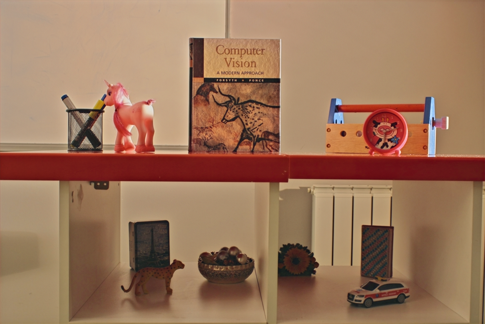

# Diff-MEF
**Diff-MEF: Cross-Modal Diffusion Framework With Text Prompts and Semantic Perception for Multi-Exposure Image Fusion（TIP2026）**
[](https://doi.org/10.1109/TIP.2026.3674682)
[](https://doi.org/10.1109/TIP.2026.3674682)
[](https://github.com/flying115/Diff-MEF)
---

## News

- [x] The inference code and environment configuration have been released.
- [x] Pretrained checkpoints are provided with Git LFS.
- [ ] More training details and benchmark results will be updated later.

---

## Overview

Multi-exposure image fusion aims to generate a well-exposed image from multiple images captured under different exposure conditions. Diff-MEF uses a cross-modal diffusion framework with:

- text prompt guidance;
- diffusion-based image generation;
- low-exposure and over-exposure image fusion;
- segmentation-guided feature refinement.

The current repository supports quick testing with pretrained checkpoints.

---
## Visual Results

### Results on MEFB

<p align="center">
  
  
  
</p>

### Results on SICE
<p align="center">
  
  
  
</p>


---
## Repository Structure

```text
Diff-MEF/
├── Diffusion/                  # Diffusion model, UNet, TDRM and encoders
├── fastsam/                    # FastSAM-related modules
├── loss/                       # Loss functions
├── ckpt/                       # Pretrained checkpoints
│   ├── ckpt_unet.pt
│   └── TDRM/
│       └── ckpt_tdrm.pt
├── dataset/
│   └── test/
│       └── SICE/
│           ├── ue/             # Under-exposed images
│           ├── oe/             # Over-exposed images
│           └── SICE_text.txt   # Text prompts
│       └── MEFB/
│           ├── ue/             # Under-exposed images
│           ├── oe/             # Over-exposed images
│           └── MEFB_text.txt   # Text prompts
├── results/                    # Inference results
├── environment.txt             # Environment package versions
├── test.py                     # Inference script
├── utils.py
└── README.md
```
---

## Environment
The code was tested with the following main environment:
```text
Python        3.9.20  PyTorch       1.13.0  TorchVision   0.14.0  TorchAudio    0.13.0
```
More detailed package versions are listed in environment.txt

---

## Citation
If you find this work useful for your research, please cite our paper:
```bibtex
@article{xu2026diff,
  title={Diff-MEF: Cross-Modal Diffusion Framework With Text Prompts and Semantic Perception for Multi-Exposure Image Fusion},
  author={Xu, Han and Huang, Yunfei and Tang, Linfeng and Ma, Jiayi and Liu, Guangcan},
  journal={IEEE Transactions on Image Processing},
  volume={35},
  pages={3186--3201},
  year={2026},
  publisher={IEEE},
  doi={10.1109/TIP.2026.3674682}
}
```
